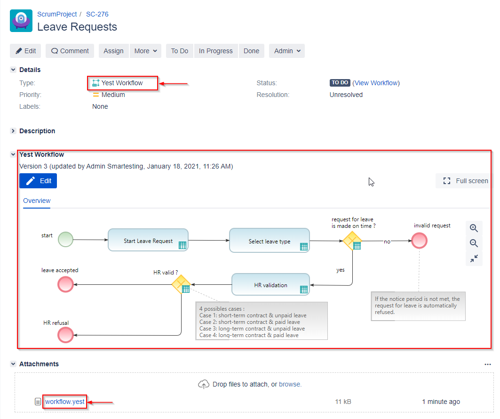
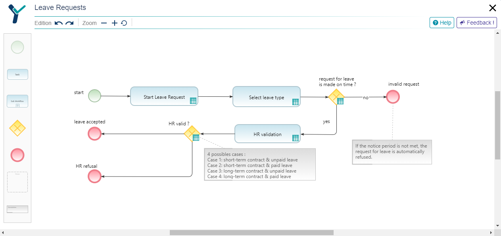

### Plugin information
Yest4Jira introduces a new issue type named 'Yest Workflow'.
A 'Yest workflow' is a graphical model (diagram BPMN-like) to figure out some business rules.
A 'Yest workflow' is designed by a functional tester or a PO and is comprehensive for all the stakeholders inside a agile team.

The DataCenter/Server version of the app is available at :
https://jira.smartesting.com/yest4jira/yest4jira-server-3.0.0.obr

> **/!\\** The concept of 'Yest Workflow' is not equivalent to the concept of workflow in Atlassian Jira. It's a graphical representation of testing use cases used in testing domain.


######Main app usage (>95%)
The main feature of the app Yest4Jira is to allow the user to design a Yest Workflow.
This design is done from an issue with the specific issue type named 'Yest Workflow'.
Thus a Jira project must be associated to this issue type to create a Yest Workflow inside. 
The content of the graphical representation is stored in a unique issue attachment named "workflow.yest".

######Others usages (<5%)
* import of existing workflows (from hard-coded Yest samples or from local BPMN.iO file).
* Jira Yest Project Configuration (with a dedicated page) helping the user to associate the 'Yest Workflow' issue type to a given project. 

###### Screenshots

1. Dedicated panel for 'Yest Workflow' issues. Dedicated issue type and dedicated attachment.



2. Yest Workflow Editor  
This editor is full client-side (React) and not uses a dedicated iframe (dialog displayed in fullscreen mode).  




### Technical information
* Yest4Jira need a new issue type in the Jira system: 'Yest Workflow'
* All the 'Yest Workflow' modifications are done via the Rest API :
    - creation/removal of the attachment `workflow.yest` (to store the diagram content)
    - update of dedicated issue property (to save the 'Yest Workflow' version)
    - add of a facultative issue comment while the 'Yest Workflow' saving
    - update of the issue links to other 'Yest Workflow' issues (sub workflows)
* The Jira Yest Project Configuration page (used to associate the issue type 'Yest Workflow' to a project) is done via a POST request (`${jira_instance}/plugins/servlet/yest/mainPage`)
* Yest4Jira does not add a new point in the existing API. 
* Yest4Jira does not communicate with an external server. The editor dialog for 'Yest Workflow' edition (cf. second screenshot) is fully client-side.

 

### Testing Notes
* \>95% of the use of Yest4Jira consists in designing: create/modify a Jira ticket typed 'Yest Workflow' (cf. screenshots).
    The remaining usages will be not tested (for Data Center approval) 
* To create/update an issue with the type 'Yest Workflow' the issue project must refer the issue type 'Yest Workflow'. A Yest configuration page helps the user to associate this issue type with a project.
 For this Yest4Jira use the url "/plugins/servlet/yest/configuration" (POST request with json data = {project: 'your_project_key'})
 This request will be tested by a JMeter entry. 
 

### Test implementation
* The 'Yest Workflow' edition will be tested by a Selenium UI test case
* The project configuration for Yest (POST request) will be tested by a Jmeter test case

#### Selenium
One UI test case (`app_yest4jira_edit`) has been implemented according the main usage (edition of workflow). 
This test is available in the dedicated folder `app/extension/jira/yest_4_jira`.
The main actions of this test are:
* open an existing 'Yest Workflow' issue ('browse' url) from a dedicated custom data set
* click 'Edit' button => an editor dialog is expected
* add an element in the workflow
* close the editor dialog => a 'Saving' dialog is expected
* confirm save & close by clicking the button 'Save and close'

###### Important Prerequisites:
The Jira instance used to execute the tests should contain a project configured for Yest (i.e. having the issue type 'Yest Workflow').
This project should contains a realistic number of issues typed 'Yest Workflow' (we created 5000 issues for the DataCenter performance testing in enterprise-scale environment). 
These issues should have the summary starting by 'YestWorkflowIssue'
As the Yest workflow is stored as attachment, then the users used for testing must have the following permissions :
  - CREATE_ATTACHMENT
  - DELETE_ALL_ATTACHMENTS
The Yest Selenium test will choose a random issue among these issues named 'YestWorkflowIssue*' 

#### JMeter
One test case has been implemented to test the POST request used to configure a project for Yest.
The frequency of project configuration is very low (set to 1%). 
The app must be installed to execute this test.  

###### Request Details:
```
method: POST 
url: /plugins/servlet/yest/configuration
data: { project: '<your_project_key>' }
```


### Run test
`bzt jira.yml`
